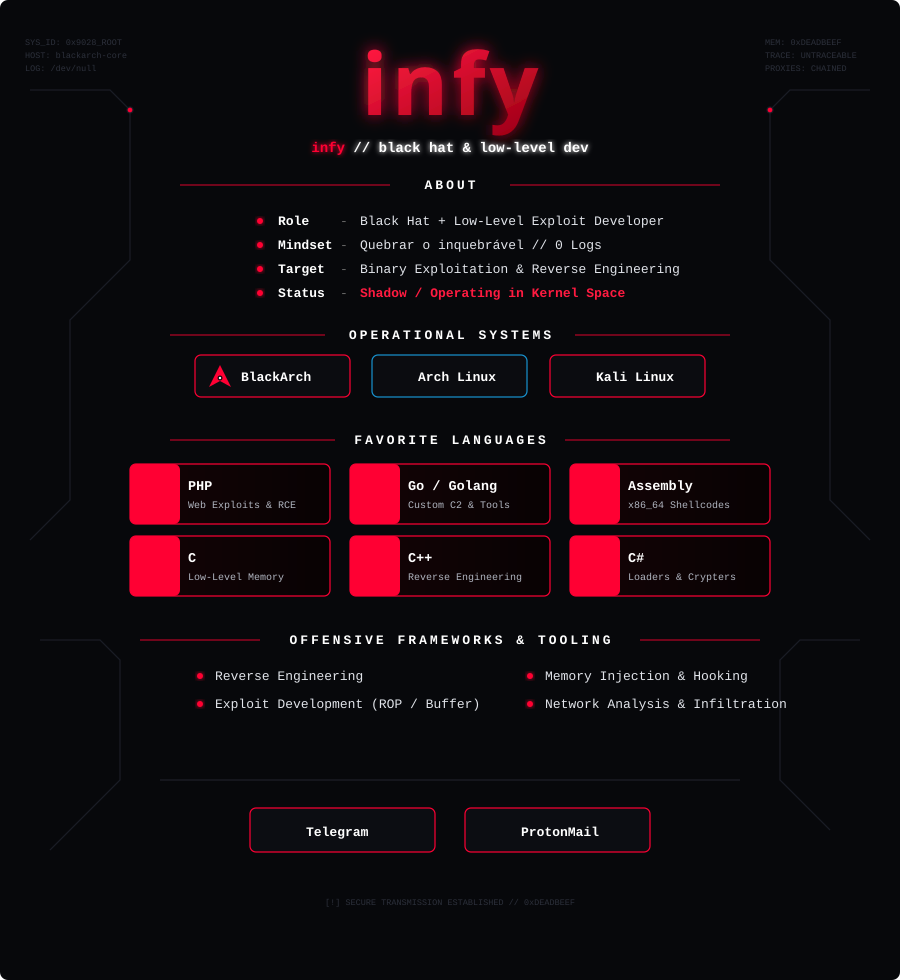

<div align="center">

  

  <br/><br/>

  <a href="https://t.me/infyweb" target="_blank">
    
  </a>
  &nbsp;&nbsp;
  <a href="mailto:infy@proton.me">
    
  </a>

  <br/><br/>

  

</div>

---

<div align="center">

```text
[!] INCOMING TRANSMISSION DETECTED
[-] PGP FINGERPRINT: 0xDEADBEEFCAFEBA00
[-] SESSION DRIFT: DISABLED // WIPING VOLATILE BUFFERS
```
